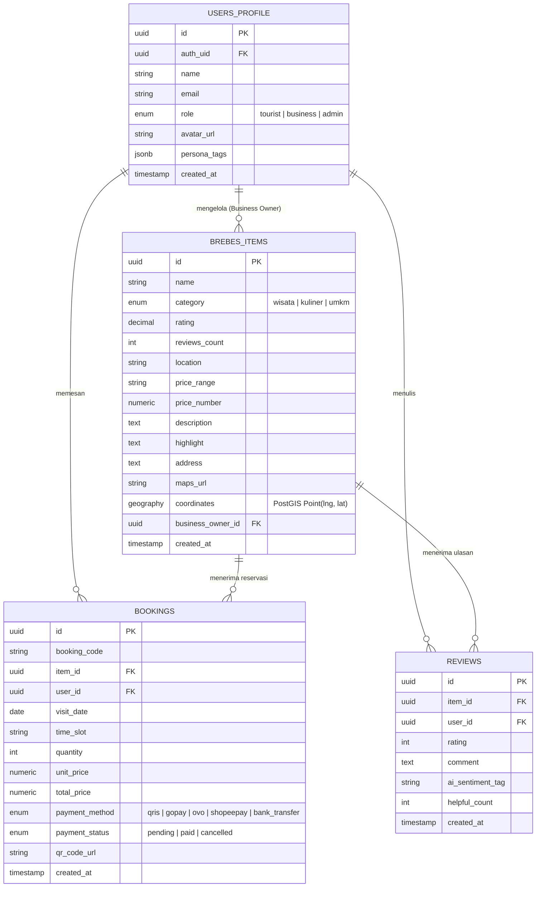

# 🏛️ Arsitektur Integrasi Supabase PostgreSQL & PostGIS — Brebes Go AI

Dokumen ini menjelaskan rancangan arsitektur, skema basis data PostgreSQL, kebijakan **Row Level Security (RLS)**, fungsi geospasial **PostGIS**, serta panduan integrasi ke dalam framework **Nuxt 4**.

---

## 🎯 1. Ringkasan & Tujuan Integrasi

Migrasi dari *Local Mock Dataset* ke **Supabase Cloud PostgreSQL** bertujuan untuk memberikan persistence layer skala produksi bagi proyek **Brebes Go AI**, dengan dukungan:
- **Pencarian Geospasial PostGIS**: Menghitung jarak terdekat wisatawan ke tempat wisata, kuliner, dan UMKM di Kabupaten Brebes.
- **Autentikasi & Authorization (Supabase Auth)**: Manajemen peran pengguna (Wisatawan, Pemilik UMKM, Admin Pemda).
- **Row Level Security (RLS)**: Proteksi data tingkat baris basis data.
- **Real-time Subscriptions**: Notifikasi pesanan/booking masuk untuk pelaku UMKM.

---

## 🏗️ 2. Diagram Skema Basis Data (Entity Relationship)



---

## 📜 3. Skrip SQL DDL & PostGIS Setup

Jalankan perintah SQL berikut di **Supabase SQL Editor**:

```sql
-- 1. Aktifkan Ekstensi PostGIS untuk Pencarian Geospasial
CREATE EXTENSION IF NOT EXISTS postgis;

-- 2. Tipe Enum Custom
CREATE TYPE user_role_type AS ENUM ('tourist', 'business', 'admin');
CREATE TYPE category_type AS ENUM ('wisata', 'kuliner', 'umkm');
CREATE TYPE booking_status_type AS ENUM ('pending', 'paid', 'cancelled');
CREATE TYPE payment_method_type AS ENUM ('qris', 'gopay', 'ovo', 'shopeepay', 'bank_transfer');

-- 3. Tabel USERS_PROFILE
CREATE TABLE public.users_profile (
    id UUID PRIMARY KEY DEFAULT gen_random_uuid(),
    auth_uid UUID UNIQUE REFERENCES auth.users(id) ON DELETE CASCADE,
    name VARCHAR(255) NOT NULL,
    email VARCHAR(255) UNIQUE NOT NULL,
    role user_role_type DEFAULT 'tourist',
    avatar_url TEXT,
    persona_tags JSONB DEFAULT '[]'::jsonb,
    created_at TIMESTAMP WITH TIME ZONE DEFAULT NOW()
);

-- 4. Tabel BREBES_ITEMS (dengan PostGIS Point)
CREATE TABLE public.brebes_items (
    id UUID PRIMARY KEY DEFAULT gen_random_uuid(),
    name VARCHAR(255) NOT NULL,
    category category_type NOT NULL,
    rating NUMERIC(3, 2) DEFAULT 4.5,
    reviews_count INT DEFAULT 0,
    location VARCHAR(255) NOT NULL,
    price_range VARCHAR(100) NOT NULL,
    price_number NUMERIC(12, 2) DEFAULT 25000,
    tags TEXT[] DEFAULT '{}',
    description TEXT NOT NULL,
    highlight TEXT NOT NULL,
    address TEXT NOT NULL,
    maps_url TEXT NOT NULL,
    best_time VARCHAR(100),
    icon VARCHAR(100) DEFAULT 'i-heroicons-sparkles',
    gradient VARCHAR(100) DEFAULT 'from-emerald-600 to-teal-800',
    coordinates GEOGRAPHY(POINT, 4326),
    business_owner_id UUID REFERENCES public.users_profile(id) ON DELETE SET NULL,
    created_at TIMESTAMP WITH TIME ZONE DEFAULT NOW()
);

-- Index Spasial PostGIS untuk Query Cepat
CREATE INDEX idx_brebes_items_coords ON public.brebes_items USING GIST(coordinates);

-- 5. Tabel BOOKINGS
CREATE TABLE public.bookings (
    id UUID PRIMARY KEY DEFAULT gen_random_uuid(),
    booking_code VARCHAR(50) UNIQUE NOT NULL,
    item_id UUID NOT NULL REFERENCES public.brebes_items(id) ON DELETE CASCADE,
    user_id UUID NOT NULL REFERENCES public.users_profile(id) ON DELETE CASCADE,
    visit_date DATE NOT NULL,
    time_slot VARCHAR(100),
    quantity INT DEFAULT 1,
    unit_price NUMERIC(12, 2) NOT NULL,
    total_price NUMERIC(12, 2) NOT NULL,
    payment_method payment_method_type DEFAULT 'qris',
    payment_status booking_status_type DEFAULT 'paid',
    qr_code_url TEXT,
    created_at TIMESTAMP WITH TIME ZONE DEFAULT NOW()
);

-- 6. Tabel REVIEWS
CREATE TABLE public.reviews (
    id UUID PRIMARY KEY DEFAULT gen_random_uuid(),
    item_id UUID NOT NULL REFERENCES public.brebes_items(id) ON DELETE CASCADE,
    user_id UUID NOT NULL REFERENCES public.users_profile(id) ON DELETE CASCADE,
    rating INT CHECK (rating BETWEEN 1 AND 5),
    comment TEXT NOT NULL,
    ai_sentiment_tag VARCHAR(255),
    helpful_count INT DEFAULT 0,
    created_at TIMESTAMP WITH TIME ZONE DEFAULT NOW()
);
```

---

## 🗺️ 4. Query Spasial PostGIS (Proximity Search)

Fungsi SQL untuk mencari tempat wisata/kuliner Brebes terdekat dari lokasi koordinat GPS wisatawan:

```sql
CREATE OR REPLACE FUNCTION get_nearby_brebes_items(
    user_lat DOUBLE PRECISION,
    user_lng DOUBLE PRECISION,
    max_distance_meters DOUBLE PRECISION DEFAULT 20000
)
RETURNS TABLE (
    id UUID,
    name VARCHAR,
    category category_type,
    location VARCHAR,
    distance_km DOUBLE PRECISION
)
LANGUAGE plpgsql
AS $$
BEGIN
    RETURN QUERY
    SELECT 
        bi.id,
        bi.name,
        bi.category,
        bi.location,
        ROUND((ST_Distance(bi.coordinates, ST_SetSRID(ST_MakePoint(user_lng, user_lat), 4326)::geography) / 1000)::numeric, 2)::DOUBLE PRECISION AS distance_km
    FROM public.brebes_items bi
    WHERE ST_DWithin(bi.coordinates, ST_SetSRID(ST_MakePoint(user_lng, user_lat), 4326)::geography, max_distance_meters)
    ORDER BY distance_km ASC;
END;
$$;
```

---

## 🔐 5. Kebijakan Keamanan (Row Level Security / RLS)

```sql
-- Aktifkan RLS pada seluruh tabel
ALTER TABLE public.users_profile ENABLE ROW LEVEL SECURITY;
ALTER TABLE public.brebes_items ENABLE ROW LEVEL SECURITY;
ALTER TABLE public.bookings ENABLE ROW LEVEL SECURITY;
ALTER TABLE public.reviews ENABLE ROW LEVEL SECURITY;

-- 1. Semua pengguna dapat membaca katalog brebes_items & reviews
CREATE POLICY "Public Read Brebes Items" ON public.brebes_items FOR SELECT USING (true);
CREATE POLICY "Public Read Reviews" ON public.reviews FOR SELECT USING (true);

-- 2. Wisatawan hanya dapat melihat booking miliknya sendiri
CREATE POLICY "User Read Own Bookings" ON public.bookings
FOR SELECT USING (auth.uid() = user_id);

-- 3. Pelaku UMKM dapat mengedit item miliknya sendiri
CREATE POLICY "Business Owner Manage Own Items" ON public.brebes_items
FOR ALL USING (
    EXISTS (
        SELECT 1 FROM public.users_profile
        WHERE auth_uid = auth.uid() AND (id = brebes_items.business_owner_id OR role = 'admin')
    )
);
```

---

## 🔌 6. Panduan Integrasi Nuxt 4

### Step 1: Install `@nuxtjs/supabase` Module
```bash
npm install @nuxtjs/supabase --save-dev
```

### Step 2: Konfigurasi `nuxt.config.ts`
```typescript
export default defineNuxtConfig({
  modules: [
    '@nuxtjs/supabase',
    '@nuxt/ui'
  ],
  supabase: {
    redirect: false, // Set true jika mewajibkan auth di semua halaman
    url: process.env.SUPABASE_URL,
    key: process.env.SUPABASE_KEY
  }
})
```

### Step 3: Server API Endpoint Nuxt 4 (`server/api/items.get.ts`)
```typescript
import { serverSupabaseClient } from '#supabase/server'

export default defineEventHandler(async (event) => {
  const client = await serverSupabaseClient(event)
  const { data, error } = await client.from('brebes_items').select('*')
  
  if (error) {
    throw createError({ statusCode: 500, statusMessage: error.message })
  }
  
  return { status: 'success', data }
})
```

---

## 📊 7. Strategi Migrasi Data dari Static Dataset
Gunakan skrip Node.js seeding untuk memindahkan data dari [`app/data/brebes-dataset.ts`](file:///home/devstar9615/hackatho-ai-gemma4/app/data/brebes-dataset.ts) ke Supabase PostgreSQL dengan mengubah koordinat `{ lat, lng }` menjadi format PostGIS `ST_SetSRID(ST_MakePoint(lng, lat), 4326)`.
