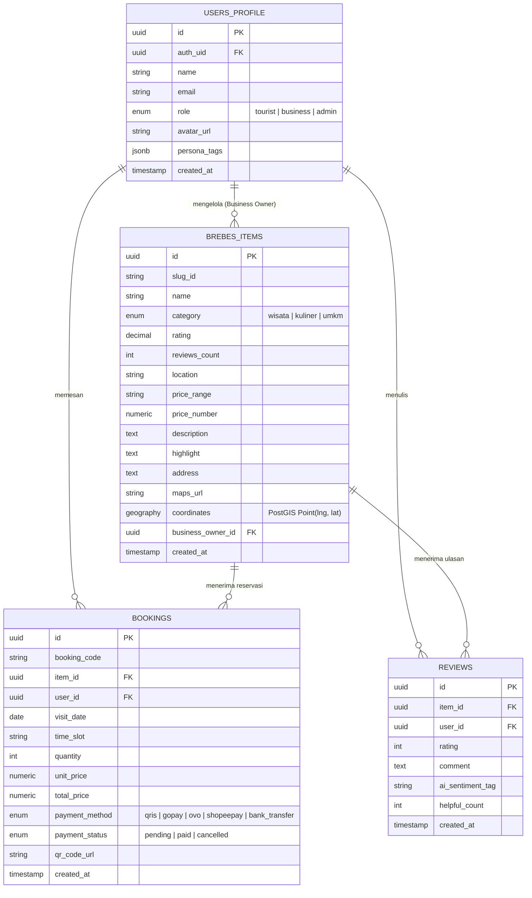

# 🏛️ Arsitektur Integrasi Supabase PostgreSQL & PostGIS — Brebes Go AI

Dokumen ini menjelaskan rancangan arsitektur, skema basis data PostgreSQL, skrip **Seed Data Lengkap**, kebijakan **Row Level Security (RLS)**, fungsi geospasial **PostGIS**, serta panduan integrasi ke dalam framework **Nuxt 4**.

---

## 🎯 1. Ringkasan & Tujuan Integrasi

Migrasi dari *Local Mock Dataset* ke **Supabase Cloud PostgreSQL** bertujuan untuk memberikan persistence layer skala produksi bagi proyek **Brebes Go AI**, dengan dukungan:
- **Pencarian Geospasial PostGIS**: Menghitung jarak terdekat wisatawan ke tempat wisata, kuliner, dan UMKM di Kabupaten Brebes.
- **Autentikasi & Authorization (Supabase Auth)**: Manajemen peran pengguna (Wisatawan, Pemilik UMKM, Admin Pemda).
- **Row Level Security (RLS)**: Proteksi data tingkat baris basis data.
- **Real-time Subscriptions**: Notifikasi pesanan/booking masuk untuk pelaku UMKM.

---

## 🏗️ 2. Diagram Skema Basis Data (Entity Relationship)



---

## 📜 3. Skrip SQL DDL & PostGIS Setup

Jalankan perintah SQL berikut di **Supabase SQL Editor**:

```sql
-- 1. Aktifkan Ekstensi PostGIS untuk Pencarian Geospasial
CREATE EXTENSION IF NOT EXISTS postgis;

-- 2. Tipe Enum Custom
CREATE TYPE user_role_type AS ENUM ('tourist', 'business', 'admin');
CREATE TYPE category_type AS ENUM ('wisata', 'kuliner', 'umkm');
CREATE TYPE booking_status_type AS ENUM ('pending', 'paid', 'cancelled');
CREATE TYPE payment_method_type AS ENUM ('qris', 'gopay', 'ovo', 'shopeepay', 'bank_transfer');

-- 3. Tabel USERS_PROFILE
CREATE TABLE public.users_profile (
    id UUID PRIMARY KEY DEFAULT gen_random_uuid(),
    auth_uid UUID UNIQUE REFERENCES auth.users(id) ON DELETE CASCADE,
    name VARCHAR(255) NOT NULL,
    email VARCHAR(255) UNIQUE NOT NULL,
    role user_role_type DEFAULT 'tourist',
    avatar_url TEXT,
    persona_tags JSONB DEFAULT '[]'::jsonb,
    created_at TIMESTAMP WITH TIME ZONE DEFAULT NOW()
);

-- 4. Tabel BREBES_ITEMS (dengan PostGIS Point)
CREATE TABLE public.brebes_items (
    id UUID PRIMARY KEY DEFAULT gen_random_uuid(),
    slug_id VARCHAR(100) UNIQUE NOT NULL,
    name VARCHAR(255) NOT NULL,
    category category_type NOT NULL,
    rating NUMERIC(3, 2) DEFAULT 4.5,
    reviews_count INT DEFAULT 0,
    location VARCHAR(255) NOT NULL,
    price_range VARCHAR(100) NOT NULL,
    price_number NUMERIC(12, 2) DEFAULT 25000,
    tags TEXT[] DEFAULT '{}',
    description TEXT NOT NULL,
    highlight TEXT NOT NULL,
    address TEXT NOT NULL,
    maps_url TEXT NOT NULL,
    best_time VARCHAR(100),
    icon VARCHAR(100) DEFAULT 'i-heroicons-sparkles',
    gradient VARCHAR(100) DEFAULT 'from-emerald-600 to-teal-800',
    coordinates GEOGRAPHY(POINT, 4326),
    business_owner_id UUID REFERENCES public.users_profile(id) ON DELETE SET NULL,
    created_at TIMESTAMP WITH TIME ZONE DEFAULT NOW()
);

-- Index Spasial PostGIS untuk Query Cepat
CREATE INDEX idx_brebes_items_coords ON public.brebes_items USING GIST(coordinates);

-- 5. Tabel BOOKINGS
CREATE TABLE public.bookings (
    id UUID PRIMARY KEY DEFAULT gen_random_uuid(),
    booking_code VARCHAR(50) UNIQUE NOT NULL,
    item_id UUID NOT NULL REFERENCES public.brebes_items(id) ON DELETE CASCADE,
    user_id UUID NOT NULL REFERENCES public.users_profile(id) ON DELETE CASCADE,
    visit_date DATE NOT NULL,
    time_slot VARCHAR(100),
    quantity INT DEFAULT 1,
    unit_price NUMERIC(12, 2) NOT NULL,
    total_price NUMERIC(12, 2) NOT NULL,
    payment_method payment_method_type DEFAULT 'qris',
    payment_status booking_status_type DEFAULT 'paid',
    qr_code_url TEXT,
    created_at TIMESTAMP WITH TIME ZONE DEFAULT NOW()
);

-- 6. Tabel REVIEWS
CREATE TABLE public.reviews (
    id UUID PRIMARY KEY DEFAULT gen_random_uuid(),
    item_id UUID NOT NULL REFERENCES public.brebes_items(id) ON DELETE CASCADE,
    user_id UUID NOT NULL REFERENCES public.users_profile(id) ON DELETE CASCADE,
    rating INT CHECK (rating BETWEEN 1 AND 5),
    comment TEXT NOT NULL,
    ai_sentiment_tag VARCHAR(255),
    helpful_count INT DEFAULT 0,
    created_at TIMESTAMP WITH TIME ZONE DEFAULT NOW()
);
```

---

##  🌱 4. Seed Data SQL Lengkap (Users, Brebes Items, Bookings & Reviews)

Jalankan skrip INSERT data lengkap berikut:

```sql
-- A. SEED USERS PROFILE (Wisatawan, Business Owner, Admin Pemda)
INSERT INTO public.users_profile (id, name, email, role, avatar_url, persona_tags) VALUES
('11111111-1111-1111-1111-111111111111', 'Budi Wisatawan', 'budi@gmail.com', 'tourist', 'https://api.dicebear.com/7.x/avataaars/svg?seed=Budi', '["Keluarga", "WisataAlam", "KulinerPedas"]'),
('22222222-2222-2222-2222-222222222222', 'Mas Yanto Blengong', 'yanto@umkmbrebes.id', 'business', 'https://api.dicebear.com/7.x/avataaars/svg?seed=Yanto', '["KulinerUMKM"]'),
('33333333-3333-3333-3333-333333333333', 'Dinas Pariwisata Brebes', 'admin@brebeskab.go.id', 'admin', 'https://api.dicebear.com/7.x/avataaars/svg?seed=Pemda', '["AdminDinas"]');

-- B. SEED KATALOG BREBES ITEMS (Lengkap dengan Koordinat PostGIS)
INSERT INTO public.brebes_items 
(slug_id, name, category, rating, reviews_count, location, price_range, price_number, tags, description, highlight, address, maps_url, best_time, icon, gradient, coordinates, business_owner_id) 
VALUES
('wisata-kaligua', 'Agrowisata Kebun Teh Kaligua', 'wisata', 4.8, 1420, 'Paguyangan, Brebes Selatan', 'Rp 20.000 - Rp 35.000', 25000, 
 ARRAY['Pegunungan', 'Sejuk', 'Keluarga', 'Sejarah', 'FotoGenic'],
 'Hamparan kebun teh hijau menawan di lereng Barat Gunung Slamet pada ketinggian 1.500 mdpl. Dilengkapi Goa Jepang bersejarah, mata air Tuk Bening, dan wahana outbound.',
 'Kawasan kebun teh pegunungan paling sejuk dan bersejarah di Brebes',
 'Desa Pandansari, Kecamatan Paguyangan, Kabupaten Brebes',
 'https://maps.google.com/?q=Agrowisata+Kaligua+Brebes', 'Pagi Hari (06.00 - 10.00 WIB)', 'i-heroicons-sun', 'from-emerald-600 to-teal-800',
 ST_SetSRID(ST_MakePoint(109.0435, -7.2608), 4326)::geography, '22222222-2222-2222-2222-222222222222'),

('wisata-mangrove', 'Hutan Mangrove Pandansari', 'wisata', 4.6, 890, 'Kaliwlingi, Brebes Kota', 'Rp 15.000 - Rp 25.000', 20000,
 ARRAY['Ekowisata', 'Pantai', 'Perahu', 'Edukasi', 'SpotFoto'],
 'Kawasan konservasi mangrove seluas 200 hektar. Pengunjung akan diajak naik perahu tradisional menyusuri muara laut menuju jembatan kayu estetik di tengah kebun mangrove.',
 'Wisata edukasi bahari dengan pengalaman naik perahu menyusuri muara',
 'Desa Kaliwlingi, Kecamatan Brebes, Kabupaten Brebes',
 'https://maps.google.com/?q=Hutan+Mangrove+Pandansari+Brebes', 'Sore Hari (15.30 - 17.30 WIB)', 'i-heroicons-sparkles', 'from-cyan-600 to-blue-800',
 ST_SetSRID(ST_MakePoint(109.0351, -6.8041), 4326)::geography, NULL),

('wisata-randusanga', 'Pantai Randusanga Indah (Parin)', 'wisata', 4.5, 2100, 'Randusanga Kulon, Brebes', 'Rp 10.000', 10000,
 ARRAY['Pantai', 'Sunset', 'KulinerLaut', 'Keluarga', 'Santai'],
 'Pantai pantai utara Brebes yang luas dengan ombak tenang, gazebo bersantai, arena bermain anak, serta deretan warung kuliner boga bahari segar.',
 'Spot terbaik menikmati pemandangan sunset pantai utara Brebes',
 'Desa Randusanga Kulon, Kecamatan Brebes, Kabupaten Brebes',
 'https://maps.google.com/?q=Pantai+Randusanga+Indah+Brebes', 'Sore Hari menjelang Sunset', 'i-heroicons-globe-alt', 'from-amber-500 to-orange-700',
 ST_SetSRID(ST_MakePoint(109.0622, -6.8115), 4326)::geography, NULL),

('wisata-curug-cantel', 'Curug Cantel Bumijawa', 'wisata', 4.7, 640, 'Sirampog, Brebes Selatan', 'Rp 10.000 - Rp 15.000', 15000,
 ARRAY['AirTerjun', 'Petualangan', 'AlamAsri', 'Fotografi'],
 'Air terjun megah setinggi 60 meter berhawa dingin segar di perbatasan Sirampog. Cocok untuk pecinta alam dan trek petualangan ringan.',
 'Air terjun tertinggi dan paling memukau di lereng Brebes Selatan',
 'Desa Batunyana, Kecamatan Sirampog, Kabupaten Brebes',
 'https://maps.google.com/?q=Curug+Cantel+Brebes', 'Pagi - Siang Hari', 'i-heroicons-bolt', 'from-blue-600 to-indigo-900',
 ST_SetSRID(ST_MakePoint(109.1105, -7.1822), 4326)::geography, NULL),

('kuliner-sate-blengong', 'Sate Blengong & Kupat Glabed Mas Yanto', 'kuliner', 4.9, 3100, 'Alun-alun Brebes Kota', 'Rp 15.000 - Rp 30.000', 25000,
 ARRAY['Legendaris', 'WajibCoba', 'PedasGurih', 'Malam', 'Ikonik'],
 'Kuliner nomor 1 paling khas Brebes! Sate berbahan daging Blengong (persilangan bebek & itik) bernuansa gurih lembut dengan bumbu cabai rempah, disajikan bersama Kupat Glabed kuah kental.',
 'Ikon kuliner Brebes yang tidak ditemukan di daerah lain manapun',
 'Jl. Ponegoro, Alun-alun Kabupaten Brebes',
 'https://maps.google.com/?q=Sate+Blengong+Mas+Yanto+Brebes', 'Malam Hari (17.00 - 23.00 WIB)', 'i-heroicons-fire', 'from-rose-600 to-red-800',
 ST_SetSRID(ST_MakePoint(109.0425, -6.8698), 4326)::geography, '22222222-2222-2222-2222-222222222222'),

('kuliner-telur-asin-yes', 'Pusat Telur Asin Yes & Tjoa Brebes', 'kuliner', 4.8, 4500, 'Jl. Pangeran Diponegoro, Brebes Kota', 'Rp 5.000 - Rp 8.000 / butir', 7000,
 ARRAY['OlehOleh', 'Legendaris', 'TelurBakar', 'MasirGurih'],
 'Pusat toko telur asin tertua di Brebes. Menyediakan varian Telur Asin Rebus, Telur Asin Bakar (aroma asap khas), Telur Asin Panggang, dan Telur Asin Kukus masir masir berminyak merah.',
 'Telur asin asli berminyak bermutu super langsung dari pelopornya',
 'Jl. Pangeran Diponegoro No. 240, Brebes Kota',
 'https://maps.google.com/?q=Toko+Telur+Asin+YES+Brebes', 'Setiap Hari (08.00 - 21.00 WIB)', 'i-heroicons-shopping-bag', 'from-amber-500 to-yellow-700',
 ST_SetSRID(ST_MakePoint(109.0418, -6.8711), 4326)::geography, NULL),

('umkm-batik-salem', 'Sentra Batik Tulis Salem Brebesan', 'umkm', 4.8, 410, 'Kecamatan Salem, Brebes', 'Rp 120.000 - Rp 750.000', 250000,
 ARRAY['BatikTulis', 'Warisankultur', 'Handmade', 'Etnik'],
 'Batik tulis asli karya ribuan pengrajin wanita Desa Bentar & Bentarsari Salem. Motif populer termasuk Kopi Pecah, Mangrove, dan Bawang Merah dengan pewarna alam.',
 'Karya seni warisan budaya batik tulis khas pedalaman Brebes',
 'Desa Bentar, Kecamatan Salem, Kabupaten Brebes',
 'https://maps.google.com/?q=Batik+Salem+Brebes', 'Jam Kerja (08.00 - 16.00 WIB)', 'i-heroicons-paint-brush', 'from-purple-600 to-indigo-800',
 ST_SetSRID(ST_MakePoint(108.8251, -7.1554), 4326)::geography, NULL);

-- C. SEED SAMPLE BOOKINGS (E-Ticket Vouchers)
INSERT INTO public.bookings
(booking_code, item_id, user_id, visit_date, time_slot, quantity, unit_price, total_price, payment_method, payment_status, qr_code_url)
VALUES
('BRB-20260801-99', 
 (SELECT id FROM public.brebes_items WHERE slug_id = 'wisata-kaligua'),
 '11111111-1111-1111-1111-111111111111', 
 '2026-08-05', '08.00 - 11.00 WIB', 2, 25000, 50000, 'qris', 'paid', 
 'https://api.qrserver.com/v1/create-qr-code/?size=250x250&data=BRB-20260801-99');

-- D. SEED SAMPLE REVIEWS
INSERT INTO public.reviews
(item_id, user_id, rating, comment, ai_sentiment_tag, helpful_count)
VALUES
((SELECT id FROM public.brebes_items WHERE slug_id = 'kuliner-sate-blengong'),
 '11111111-1111-1111-1111-111111111111', 5,
 'Sate blengongnya empuk banget dan bumbu pedas manisnya pas mantap! Wajib coba pas malam ke Alun-alun Brebes.',
 '🌟 Sangat Direkomendasikan', 12);
```

---

## 🗺️ 5. Query Spasial PostGIS (Proximity Search)

Fungsi SQL untuk mencari tempat wisata/kuliner Brebes terdekat dari lokasi koordinat GPS wisatawan:

```sql
CREATE OR REPLACE FUNCTION get_nearby_brebes_items(
    user_lat DOUBLE PRECISION,
    user_lng DOUBLE PRECISION,
    max_distance_meters DOUBLE PRECISION DEFAULT 20000
)
RETURNS TABLE (
    id UUID,
    name VARCHAR,
    category category_type,
    location VARCHAR,
    distance_km DOUBLE PRECISION
)
LANGUAGE plpgsql
AS $$
BEGIN
    RETURN QUERY
    SELECT 
        bi.id,
        bi.name,
        bi.category,
        bi.location,
        ROUND((ST_Distance(bi.coordinates, ST_SetSRID(ST_MakePoint(user_lng, user_lat), 4326)::geography) / 1000)::numeric, 2)::DOUBLE PRECISION AS distance_km
    FROM public.brebes_items bi
    WHERE ST_DWithin(bi.coordinates, ST_SetSRID(ST_MakePoint(user_lng, user_lat), 4326)::geography, max_distance_meters)
    ORDER BY distance_km ASC;
END;
$$;
```

---

## 🔐 6. Kebijakan Keamanan (Row Level Security / RLS)

```sql
-- Aktifkan RLS pada seluruh tabel
ALTER TABLE public.users_profile ENABLE ROW LEVEL SECURITY;
ALTER TABLE public.brebes_items ENABLE ROW LEVEL SECURITY;
ALTER TABLE public.bookings ENABLE ROW LEVEL SECURITY;
ALTER TABLE public.reviews ENABLE ROW LEVEL SECURITY;

-- 1. Semua pengguna dapat membaca katalog brebes_items & reviews
CREATE POLICY "Public Read Brebes Items" ON public.brebes_items FOR SELECT USING (true);
CREATE POLICY "Public Read Reviews" ON public.reviews FOR SELECT USING (true);

-- 2. Wisatawan hanya dapat melihat booking miliknya sendiri
CREATE POLICY "User Read Own Bookings" ON public.bookings
FOR SELECT USING (auth.uid() = user_id);

-- 3. Pelaku UMKM dapat mengedit item miliknya sendiri
CREATE POLICY "Business Owner Manage Own Items" ON public.brebes_items
FOR ALL USING (
    EXISTS (
        SELECT 1 FROM public.users_profile
        WHERE auth_uid = auth.uid() AND (id = brebes_items.business_owner_id OR role = 'admin')
    )
);
```

---

## 🔌 7. Panduan Integrasi Nuxt 4

### Step 1: Install `@nuxtjs/supabase` Module
```bash
npm install @nuxtjs/supabase --save-dev
```

### Step 2: Konfigurasi `nuxt.config.ts`
```typescript
export default defineNuxtConfig({
  modules: [
    '@nuxtjs/supabase',
    '@nuxt/ui'
  ],
  supabase: {
    redirect: false,
    url: process.env.SUPABASE_URL,
    key: process.env.SUPABASE_KEY
  }
})
```

### Step 3: Server API Endpoint Nuxt 4 (`server/api/items.get.ts`)
```typescript
import { serverSupabaseClient } from '#supabase/server'

export default defineEventHandler(async (event) => {
  const client = await serverSupabaseClient(event)
  const { data, error } = await client.from('brebes_items').select('*')
  
  if (error) {
    throw createError({ statusCode: 500, statusMessage: error.message })
  }
  
  return { status: 'success', data }
})
```
